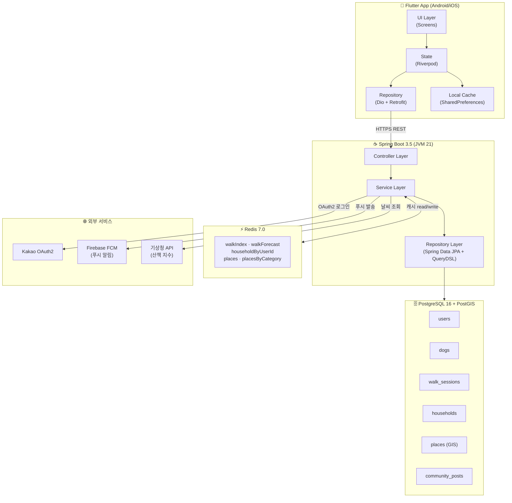
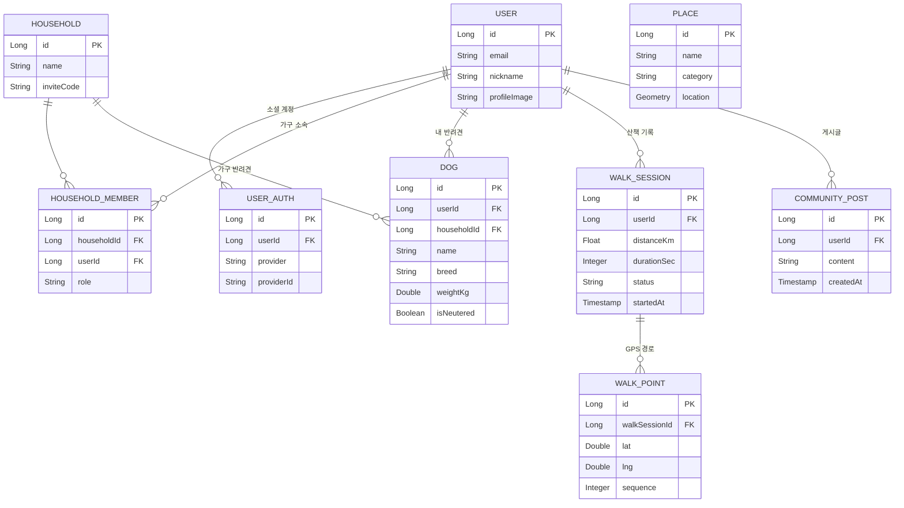
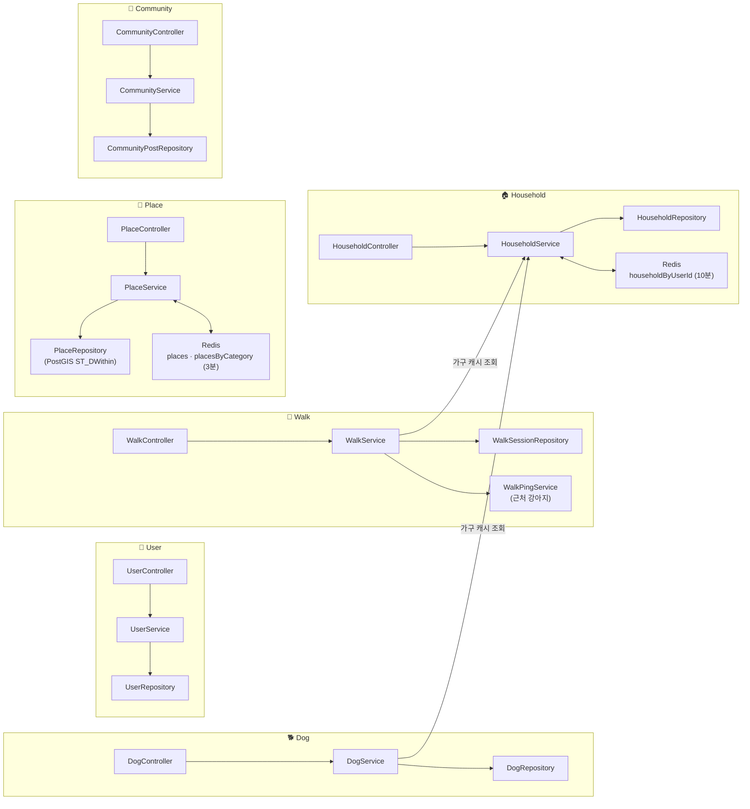
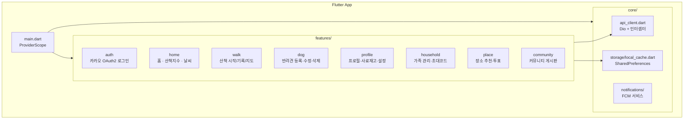

# 🐶 Doggy

반려견 산책 기록 및 관리 앱

---

## 아키텍처 개요

---

## 도메인 관계도

---

## 백엔드 도메인 구조

---

## 프론트엔드 구조

---

## 기술 스택 요약

### 백엔드
| 분류 | 기술 |
|------|------|
| 언어 / 런타임 | Java 21 (JVM) |
| 프레임워크 | Spring Boot 3.5 |
| 데이터베이스 | PostgreSQL 16 + PostGIS 3.4 |
| DB 마이그레이션 | Flyway (버전 관리, V1~V3) |
| ORM | Spring Data JPA + Hibernate Spatial |
| 쿼리 빌더 | QueryDSL 5.1 (타입 안전 동적 쿼리) |
| 인증 | Spring Security + OAuth2 + JWT |
| 캐시 | Redis 7.0 (분산 캐시, Spring Cache 추상화) |
| 커넥션 풀 | HikariCP |
| 푸시 알림 | Firebase Admin SDK (FCM) |
| 배치 | Spring Batch (생일 · 건강검진 알림) |

### 프론트엔드
| 분류 | 기술 |
|------|------|
| 프레임워크 | Flutter (Dart 3.11) |
| 상태 관리 | Riverpod 2.6 |
| HTTP 클라이언트 | Dio + Retrofit |
| 지도 | 네이버 지도 SDK |
| 위치 | Geolocator |
| 로컬 캐시 | SharedPreferences (stale-while-revalidate) |
| 푸시 알림 | Firebase Messaging |

### 인프라
| 분류 | 기술 |
|------|------|
| 로컬 개발 DB | Docker Compose (postgis/postgis:16-3.4) |
| 캐시 서버 | Redis 7.0 (systemctl, 단일 노드 → 멀티 인스턴스 대응 가능) |
| 배포 | Linux 서버 · systemctl JAR 실행 |
| 소셜 로그인 | Kakao / Google / Naver OAuth2 |
| OAuth redirect URI | 환경변수 `${SERVER_BASE_URL}` (IP 하드코딩 제거) |

### 운영 환경 변수

네이버클라우드 서버에는 실제 값을 환경 변수로 주입하고, repo에는 시크릿 값을 커밋하지 않습니다.
로컬 실행용 `backend/src/main/resources/application.properties`와 `application-local.properties`는 git ignore 대상입니다.
설정 키 목록은 `backend/src/main/resources/application.properties.example`을 기준으로 관리합니다.

필수:
- `DB_URL`
- `DB_USERNAME`
- `DB_PASSWORD`
- `JWT_SECRET`
- `SERVER_BASE_URL`
- `KAKAO_CLIENT_ID`
- `KAKAO_CLIENT_SECRET`
- `GOOGLE_CLIENT_ID`
- `GOOGLE_CLIENT_SECRET`
- `NAVER_CLIENT_ID`
- `NAVER_CLIENT_SECRET`
- `WEATHER_API_KEY`
- `AIR_STATION_API_KEY`

선택:
- `PORT`
- `IMAGE_UPLOAD_DIR`
- `FCM_CREDENTIALS_PATH` 또는 `FCM_CREDENTIALS_BASE64`
- `REDIS_HOST`
- `REDIS_PORT`
- `REDIS_PASSWORD`
- `CACHE_TYPE`
